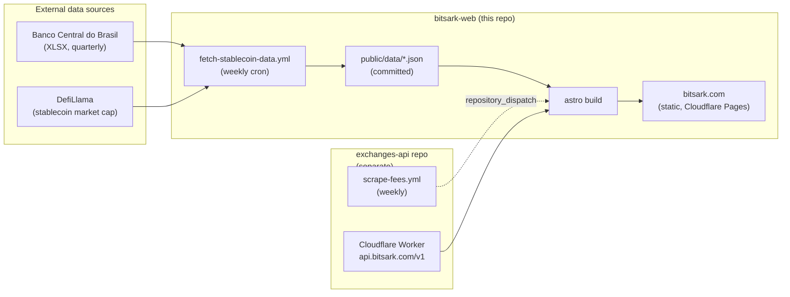

<div align="center">

# bitsARK Labs

**Financial data infrastructure for the Brazilian crypto market.**

[](https://astro.build)
[](https://pages.cloudflare.com)
[](./LICENSE)

[Live site](https://bitsark.com) · [Public API](https://api.bitsark.com/v1/exchanges) · [Documentation](./docs)

</div>

---

## What this is

A production website that turns scattered, opaque Brazilian crypto regulation into structured, queryable data - and ships it as a fast static site, a free public REST API, and a mobile app.

Built by one engineer. Optimized for **SEO** (Lighthouse ≥ 95 mobile), **resilience** (zero-runtime-dependency static rendering), and **legitimacy** (real regulatory data sourced from the Banco Central do Brasil and Receita Federal).

## Products

| Product | What it does | Where |
|---|---|---|
| **DolarMap** | Mobile app tracking USD/BRL across major Brazilian exchanges in real time, with price alerts and arbitrage analytics. | [bitsark.com/dolarmap](https://bitsark.com/dolarmap) · [Google Play](https://play.google.com/store) |
| **Exchanges Directory** | Curated directory of Brazilian crypto exchanges with BCB licensing status, Pix support, trading fees, and tax regime per exchange. | [bitsark.com/exchanges](https://bitsark.com/exchanges) |
| **Public Exchange API** | Free, no-auth REST API serving the same data. Used by third parties and the site itself. | [api.bitsark.com/v1/exchanges](https://api.bitsark.com/v1/exchanges) · [docs](https://bitsark.com/exchanges/api) |
| **Stablecoins Brasil** | Data-driven page tracking stablecoin adoption in Brazil, charting BCB Balance-of-Payments inflows against the global market cap from DefiLlama. | [bitsark.com/stablecoins-brasil](https://bitsark.com/stablecoins-brasil) |

## Architecture at a glance



- **Static-first**: every public page is pre-rendered at build time. No SSR, no databases, no runtime backend on the website itself.
- **Data pipelines run weekly** via GitHub Actions, commit fresh JSON to the repo, and trigger a Cloudflare Pages rebuild.
- **One external API**: a Cloudflare Worker in [`exchanges-api`](https://github.com/bitsARK-Labs/exchanges-api) serves the public exchange endpoints (and feeds the site's `getStaticPaths`).

See [`docs/architecture.md`](./docs/architecture.md) for the *why* behind every choice, and [`docs/data-pipelines.md`](./docs/data-pipelines.md) for the data flows in detail.

## Stack

| Layer | Choice | Rationale (full reasoning in [architecture.md](./docs/architecture.md)) |
|---|---|---|
| Framework | **Astro 5** | Zero-JS by default, partial hydration only where needed → ideal for content + SEO. |
| Hosting | **Cloudflare Pages** | Free tier + edge network + Git integration. KV and Workers in the same plane. |
| Backend (feedback) | **Cloudflare Pages Functions** + KV | Stateless serverless for the only mutable endpoint (feedback form). |
| Exchange API | **Cloudflare Worker** ([separate repo](https://github.com/bitsARK-Labs/exchanges-api)) | Public REST API, decoupled deploy lifecycle. |
| Email | **Resend** | Modern transactional email with verified domain auth. |
| Styling | **Custom CSS design system** (no Tailwind) | Full control of design tokens, zero framework bloat. |
| Type system | **TypeScript** (strict in app paths) | Catches API contract drift between scripts/components. |
| Fonts | **Geist + Geist Mono** (self-hosted) | No third-party font CDN latency. |
| Charts | **Chart.js** (lazy-loaded only on `/stablecoins-brasil`) | Single page needs it; not worth a global dependency. |

## Performance targets

| Metric | Budget | Where it is measured |
|---|---|---|
| Lighthouse Performance (mobile) | **≥ 95** | `npm run lh:check` via [`lighthouserc.json`](./lighthouserc.json) |
| Lighthouse SEO | **100** | same |
| Lighthouse Accessibility | **≥ 95** | same |
| LCP | **< 2.0s** on 4G | CrUX / Lighthouse |
| INP | **< 200ms** | Real-user via CrUX |
| Largest JS bundle on critical path | **0 KB** non-essential | Astro static output |

## Quick start

**Requirements:** Node.js 20 LTS or newer (matches the GitHub Actions runtime).

```bash
npm install
npm run dev              # http://localhost:4321
npm run build            # static output in dist/
npm run preview          # serve the production build locally
npm run fetch-data       # force a stablecoin data refresh (no commit)
npm run og               # regenerate Open Graph images (Satori → PNG)
npm run lh:check         # run Lighthouse CI against the production build
```

No environment variables are required for local development. The site reads data from `public/data/` (committed) and from `https://api.bitsark.com/v1/exchanges` (public, no auth).

Runtime secrets used in production (configured in Cloudflare Pages → Functions, **never committed**):

- `RESEND_API_KEY` - for feedback email delivery
- `EMAIL_TO` - destination for feedback submissions

## Repository layout

```
bitsark-web/
├── src/
│   ├── components/        Astro components (Logo, ExchangeMarquee, ...)
│   ├── data/              Static seed data (e.g. exchanges.js fallback)
│   ├── i18n/              EN + PT-BR translations + helpers
│   ├── layouts/           Base layout (head, nav, footer, schema.org)
│   ├── pages/             File-based routing
│   │   ├── dolarmap/      App landing + privacy/terms/support
│   │   ├── exchanges/     Directory, [slug], api docs, decripto guide
│   │   ├── stablecoins-brasil/
│   │   ├── pt/            PT-BR localized routes
│   │   └── ...
│   └── styles/            Design system + per-page CSS
├── public/
│   ├── data/              Auto-generated JSONs (committed by GH Actions)
│   ├── fonts/             Self-hosted Geist + Geist Mono
│   └── og/                Generated Open Graph images
├── scripts/               Build-time and pipeline scripts (Node ESM)
├── functions/             Cloudflare Pages Functions (feedback.js)
├── .github/workflows/     CI/CD: deploy trigger + data pipeline
└── docs/                  Engineering documentation
    ├── architecture.md      Why this stack, design decisions
    ├── data-pipelines.md    Exchanges + Stablecoins flows in detail
    └── maintenance.md       Runbooks, troubleshooting, checklists
```

## Documentation

| Document | Read this when... |
|---|---|
| [docs/architecture.md](./docs/architecture.md) | You want to understand the stack choices, design system, i18n, and SEO strategy. |
| [docs/data-pipelines.md](./docs/data-pipelines.md) | You're touching exchange data flow or the BCB/DefiLlama stablecoin pipeline. |
| [docs/maintenance.md](./docs/maintenance.md) | Something broke, or you need to add an exchange, refresh data manually, or run pre-deploy checks. |

## License

MIT - see [LICENSE](./LICENSE).

---

<div align="center">

Built and maintained by [bitsARK Labs](https://bitsark.com) · [support@bitsark.com](mailto:support@bitsark.com)
A brand of **Tecnologia Atual Serviços LTDA** · CNPJ 51.334.748/0001-61

</div>
