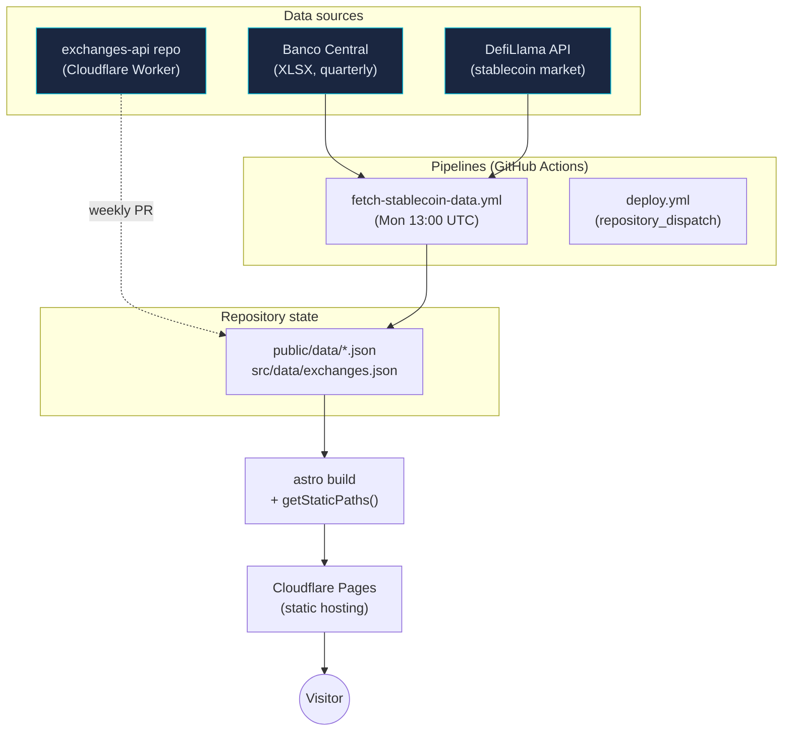

# Architecture

This document explains the **why** behind every significant technical choice in `bitsark-web`. If you want to understand *how* the data flows, see [data-pipelines.md](./data-pipelines.md). If you want to *operate* the site, see [maintenance.md](./maintenance.md).

---

## High-level overview

`bitsark-web` is a **static-first** website with two **out-of-band data pipelines** that feed it. There is no application server, no database, and no runtime backend on the website itself. The only mutable surface is a single Cloudflare Pages Function for the feedback form.



### What lives where

| Concern | Where it lives |
|---|---|
| Public site (HTML/CSS/JS) | This repo → built with Astro → deployed to Cloudflare Pages at `bitsark.com` |
| Exchange data REST API | Separate repo [`exchanges-api`](https://github.com/bitsARK-Labs/exchanges-api) → Cloudflare Worker at `api.bitsark.com/v1` (third-party consumers) |
| Exchange data for site build | This repo → `src/data/exchanges.json` → updated by auto-PRs from `exchanges-api` |
| Stablecoin data | This repo → fetched weekly by Action → committed to `public/data/*.json` |
| Feedback form backend | This repo → `functions/feedback.js` (Cloudflare Pages Function) + Cloudflare KV |
| Email delivery | [Resend](https://resend.com), domain-verified for `bitsark.com` |

---

## Stack decisions

Each subsection answers "why this and not the obvious alternative?". These are the decisions a recruiter or new collaborator will most want to see justified.

### Why Astro (and not Next.js / Remix / SvelteKit)

**Choice:** Astro 5 with the static output adapter.

**Why:**

- The site is **content-heavy and interaction-light**. The vast majority of pages (landing, exchange directory, exchange detail, stablecoins page, legal pages) render data that changes weekly at most. SSR per request would waste compute on every visit for no benefit.
- Astro's **island architecture** lets us ship zero JavaScript for the 90% of pages that don't need it, and hydrate only the small pieces that do (e.g. Chart.js on `/stablecoins-brasil`, filter logic on `/exchanges`). Next.js's per-page client bundles are heavier even with App Router optimization.
- **Markdown / MDX / `.astro` mix** is ergonomic for content. We don't need React's component ecosystem because we don't have an interactive product surface - that lives in the mobile app.
- **SEO wins**: pre-rendered HTML with structured data is what both Google and AI search engines (ChatGPT, Perplexity, Google AI Overviews) reward. Astro makes this the default path, not an optimization.
- **Build is fast** (~10s cold), so deploys are cheap to iterate on.

**Trade-off accepted:** Astro's ecosystem is smaller than Next.js. We compensate by writing the few interactive pieces ourselves rather than reaching for a library.

### Why Cloudflare Pages (and not Vercel / Netlify)

**Choice:** Cloudflare Pages with Git integration.

**Why:**

- **Free tier is genuinely free at our traffic level** - unmetered bandwidth, no surprise bills.
- **KV and Workers live in the same plane**: the feedback function and the exchange API (in a sibling repo) both deploy to Cloudflare. One vendor, one billing surface, one DNS.
- **Git integration is push-to-deploy without configuration**: any commit on `main` triggers a build. No CI tokens stored in the repo.
- **Edge network is wider than Vercel's free tier** and the cold-start story for Workers is class-leading.
- **No vendor lock-in on the framework side**: Astro outputs static HTML; we could swap hosts in an hour if needed.

**Trade-off accepted:** Cloudflare's Pages build environment is more bare-bones than Vercel's. We pay for that by being explicit in our build scripts (`prebuild` runs OG generation, etc.) rather than relying on platform magic.

### Why a custom CSS design system (and no Tailwind)

**Choice:** Hand-rolled CSS in [`src/styles/global.css`](../src/styles/global.css) using CSS custom properties as design tokens.

**Why:**

- **Branding matters here**: the site is judged by recruiters and prospective users of a financial product. A generic "looks like every Tailwind site" aesthetic actively hurts credibility. The palette (cyan primary, emerald accent, deep blue-black surface) is chosen to evoke Bloomberg Terminal / financial data, not consumer SaaS.
- **Zero CSS framework = zero CSS framework bloat**. The entire stylesheet is small enough to inline-critical and ship as one file.
- **CSS variables are the right primitive for theming** - no PostCSS plugin needed, no JIT compiler, no `safelist` to maintain.
- **`--font-mono` is used semantically** (fees, rates, CNPJ numbers, codes) to signal "this is a structured datum" - a thing Tailwind doesn't help with.

**Trade-off accepted:** No utility-class shortcut for one-off layouts. We make up for it with a small, consistent set of reusable classes per page (see `src/styles/pages/*.css`).

### Why a hand-written i18n layer (and not Astro's built-in i18n)

**Choice:** Translations live in [`src/i18n/en.json`](../src/i18n/en.json) and [`src/i18n/pt.json`](../src/i18n/pt.json), consumed via a thin [`useTranslations`](../src/i18n/ui.ts) helper. Routes are physically duplicated under `/pt/`.

**Why:**

- **Some routes are language-pinned by design**: `/dolarmap/privacy` and `/dolarmap/terms` are legally Portuguese (Brazilian app store requirement); `/stablecoins-brasil` exists in both for SEO. Default `<html lang="en">` aligns with the international recruiting and Google Play store audience.
- **Astro's i18n routing assumes uniform translation** of every page - which we don't want. The custom approach lets us version routes per language independently.
- **`hreflang` alternates are hand-set per page**, giving precise control of canonical URLs for SEO.

**Trade-off accepted:** Manual route duplication. Acceptable at our scale (~10 routes); we'd reconsider at 100+.

### Why data lives in the repo (and not in a database)

**Choice:** Exchange data and stablecoin data both end up as **JSON committed to the repo**. There is no database.

**Why:**

- **Git is a version-controlled database**: every fee change, every CNPJ correction, every BCB data point is a commit. `git log src/data/exchanges.js` is the audit trail.
- **Static rendering needs static data**: the data is read at build time. A database would force runtime fetches, killing the static model.
- **Backup is free**: every clone is a full backup.
- **Code review on data**: when the `exchanges-api` scraper proposes a fee change, it can come as a PR that a human (me) reviews before it ships. A database write is invisible.

This is the same reasoning behind treating **`exchanges-api` as a sibling Git repo with its own Worker**: data lives in one place, two consumers (the public REST API and this site's build) read from it.

### Why a separate repo for the exchange API

**Choice:** [`bitsARK-Labs/exchanges-api`](https://github.com/bitsARK-Labs/exchanges-api) is a separate repository hosting both the canonical data and the Cloudflare Worker that exposes it.

**Why:**

- **Deploy independence**: the Worker can ship a hotfix without forcing a site rebuild, and vice versa.
- **Reuse**: third parties consume the API directly. Having it in the website repo would imply it's an internal endpoint.
- **Different scraping cadence**: the Worker's data is updated weekly by `scrape-fees.yml`; the website's content is updated whenever I push. Decoupling avoids spurious deploys.
- **Clearer permission boundary**: the scraper bot's PAT only needs write to one repo to push data, not the entire site.

---

## Design system

The full token set is in [`src/styles/global.css`](../src/styles/global.css). Summary of the philosophy:

### Palette

- **Background**: deep blue-black (`#080d12`) → more sophisticated than pure black; reminiscent of financial terminals.
- **Primary**: cyan (`#06b6d4`) → associated with data, infrastructure, stablecoins (USDC's brand). Deliberately *not* yellow (Binance) or orange (Bybit).
- **Accent**: emerald (`#10b981`) → reserved for positive states (success, growth, "market up").
- **Semantics**: green `#10b981` (success), amber `#f59e0b` (warning), rose `#f43f5e` (error). Red is used sparingly - financial UIs that scream red on every neutral state lose trust.

### Typography

- **Geist** (Vercel's open-source typeface) for display and body. **Geist Mono** for numbers, CNPJs, fees, API examples.
- Both self-hosted from `public/fonts/` to eliminate Google Fonts latency.
- Scale uses `clamp()` for fluid responsiveness without media-query breakpoints.

### Spacing / radius / motion

- Radius scale: `--radius-sm: 0.25rem` → `--radius-xl: 1rem`.
- Motion: a single `--transition: 180ms cubic-bezier(0.16, 1, 0.3, 1)` token. No GSAP, no Framer Motion - CSS transitions cover every animation in the site.

---

## Repository layout

```
src/
├── components/        Reusable Astro components (PascalCase)
├── data/              Static data - currently exchanges.js fallback
├── i18n/              Translation JSONs + useTranslations helper
├── layouts/           Base.astro (head, nav, footer, schema.org orchestration)
├── pages/             File-based routing
│   ├── dolarmap/      App landing + privacy/terms/support (PT-BR legal)
│   ├── exchanges/     index, [slug], api, decripto
│   ├── stablecoins-brasil/
│   ├── pt/            PT-BR localized routes (mirror of EN structure where translated)
│   ├── about.astro
│   ├── index.astro    Home
│   └── 404.astro
└── styles/
    ├── global.css     Design tokens + base styles
    └── pages/         Per-page styles (loaded only by the page that needs them)

public/
├── data/              JSONs committed by GitHub Actions (do not edit by hand)
├── fonts/             Self-hosted Geist + Geist Mono
├── images/            SVGs and raster assets
└── og/                Open Graph images generated by scripts/generate-og.mjs

scripts/
├── fetch-stablecoin-data.js   Pipeline: DefiLlama + BCB → public/data/*.json
├── generate-og.mjs            Build-time OG image generation (Satori)
└── _archive/                  Old scripts kept for reference, prefixed with _

functions/
└── feedback.js        Cloudflare Pages Function - feedback form backend

.github/workflows/
├── deploy.yml                   Triggers rebuild when exchanges-api dispatches
└── fetch-stablecoin-data.yml    Weekly cron for stablecoin data
```

### Path aliases

Configured in `tsconfig.json` and `astro.config.mjs`:

| Alias | Resolves to |
|---|---|
| `@layouts/*` | `src/layouts/*` |
| `@components/*` | `src/components/*` |
| `@data/*` | `src/data/*` |
| `@i18n/*` | `src/i18n/*` |
| `@styles/*` | `src/styles/*` |

Use the alias, not relative paths, in any new code.

---

## SEO strategy

SEO is a first-class concern - `/exchanges` is meant to rank for "exchanges cripto Brasil" and similar long-tail terms, and `/stablecoins-brasil` for educational queries about stablecoin adoption in Brazil.

### Per-page essentials (enforced in [`Base.astro`](../src/layouts/Base.astro))

- Canonical URL set explicitly (no defaulting).
- Open Graph + Twitter Card meta tags. OG images generated at build time by `scripts/generate-og.mjs` (Satori → 1200×630 PNG, served from `public/og/`).
- `hreflang` alternates between EN and PT-BR variants where both exist.
- `schema.org` JSON-LD: `Organization` site-wide, `WebPage` per page, `BreadcrumbList` on nested routes, `FAQPage` on `/stablecoins-brasil`, `Organization` per exchange on `/exchanges/[slug]`.

### Site-wide

- `sitemap.xml` generated by `@astrojs/sitemap` integration.
- `robots.txt` (in `public/`) permits all crawlers, points to the sitemap.
- No `noindex` traps. Every public route is meant to be indexable.

### AI search readiness

- Structured data + clean HTML semantics → eligible for Google AI Overviews and ChatGPT browsing citations.
- Page titles and `<h1>` use natural-language phrasing matching how users describe the topic (not jargon).
- Stablecoins page surfaces methodology notes inline - LLMs cite sources that explain their numbers.

---

## Performance budget

These are hard constraints. Anything that violates them does not ship.

| Budget | Limit | Enforced by |
|---|---|---|
| Lighthouse Performance (mobile) | ≥ 95 | `npm run lh:check` (CI runs locally pre-release) |
| Lighthouse SEO | 100 | same |
| LCP | < 2.0s | CrUX / Lighthouse |
| Critical-path JS | 0 KB of non-essential JS | Astro static output + manual review |
| External JS dependencies on the critical path | **none** | manual review |
| Web fonts | Preload only Geist + Geist Mono regular | `<link rel="preload">` in Base.astro |
| Images | SVG inline (preferred) or `<Image>` with `loading="lazy"` | manual review |
| Animation framework | none - only CSS `transition` | manual review |

The single justified exception is **Chart.js on `/stablecoins-brasil`**, lazy-loaded *after* first paint, and only on that one page.

---

## Coding conventions

- **Astro components**: PascalCase, one component per file (`Logo.astro`, `ExchangeMarquee.astro`).
- **Pages**: kebab-case folders with `index.astro` inside (`/dolarmap/index.astro`).
- **CSS**: always via design tokens - no hardcoded colors, sizes, or radii outside `global.css`.
- **Data**: centralize in `src/data/` or `public/data/`. Never inline data in pages.
- **Commits**: conventional commits (`feat:`, `fix:`, `chore:`, `docs:`, `refactor:`).
- **Imports**: always via the path aliases above (`@layouts/Base.astro`), never relative.

---

## Architectural notes

### `/exchanges` - build-time rendering from committed JSON

**Implemented.** [`src/pages/exchanges/index.astro`](../src/pages/exchanges/index.astro) and [`src/pages/exchanges/[slug].astro`](../src/pages/exchanges/[slug].astro) import [`src/data/exchanges.json`](../src/data/exchanges.json) at build time. There is no client-side fetch and no runtime dependency on `api.bitsark.com`.

Data helpers (`getExchangeBySlug`, `getAllSlugs`, `taxRegimeLabel`, `isoFlag`, `fmtFee`) live in [`src/lib/exchanges.ts`](../src/lib/exchanges.ts).

The update flow: `exchanges-api/scrape-fees.yml` → opens PR on this repo → merge → Cloudflare Pages rebuilds. See [data-pipelines.md](./data-pipelines.md#pipeline-1-exchanges) for full detail.

**Remaining step (in `exchanges-api` repo):** Add a `peter-evans/create-pull-request@v6` step to `scrape-fees.yml` that writes `data/exchanges.json` into `src/data/exchanges.json` here via the `BITSARK_WEB_PAT` secret.

**Why this shape:**
- **SEO**: full HTML at first response, every datum indexable.
- **Resilience**: site builds fully offline - no runtime API dependency.
- **Auditability**: every fee change is a reviewable PR with git history.
- **Single source of truth**: no drift between a fallback seed and live API data.

### (Smaller) Lazy-load Chart.js per-feature

Currently loaded once on `/stablecoins-brasil`. If a second page ever needs charts, factor into a shared lazy-loader to avoid double-shipping.

---

*This document is part of the [bitsARK-web documentation](./). For data flow specifics, see [data-pipelines.md](./data-pipelines.md). For operations, see [maintenance.md](./maintenance.md).*
