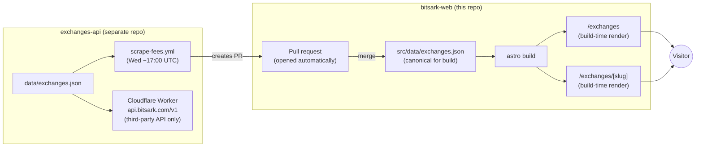
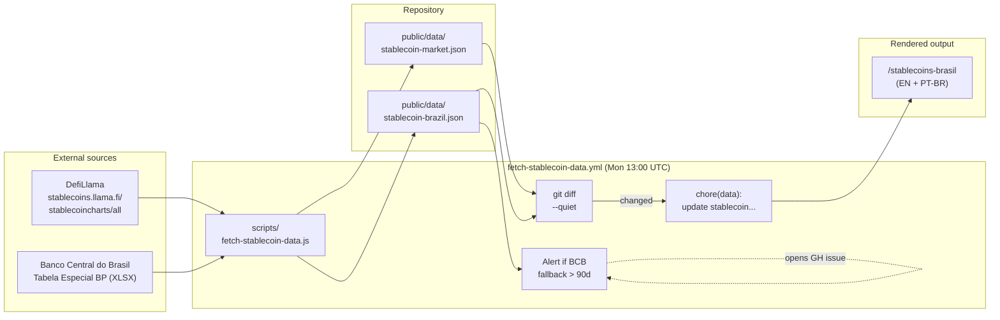

# Data Pipelines

Two automated pipelines keep `bitsark-web` fresh without manual intervention. This document describes both end-to-end: where the data originates, how it travels, where it lands, and what to do when something breaks.

| Pipeline | Source(s) | Cadence | Output | Pipeline owner |
|---|---|---|---|---|
| **Exchanges** | [`exchanges-api`](https://github.com/bitsARK-Labs/exchanges-api) repo | Weekly (Wed ~17:00 UTC) via auto-PR | [`src/data/exchanges.json`](../src/data/exchanges.json) committed to this repo | PR merge → Cloudflare Pages Git integration |
| **Stablecoins** | [DefiLlama](https://stablecoins.llama.fi) + [Banco Central do Brasil](https://www.bcb.gov.br/estatisticas/tabelasespeciais) | Weekly (Mon 13:00 UTC) | [`public/data/stablecoin-market.json`](../public/data/stablecoin-market.json) and [`public/data/stablecoin-brazil.json`](../public/data/stablecoin-brazil.json) | [`fetch-stablecoin-data.yml`](../.github/workflows/fetch-stablecoin-data.yml) |

For troubleshooting any of these, jump to [maintenance.md](./maintenance.md#runbooks).

---

## Pipeline 1: Exchanges

The exchanges data lives in a **separate Git repository**, [`bitsARK-Labs/exchanges-api`](https://github.com/bitsARK-Labs/exchanges-api), which serves two consumers:

1. A public REST API at `https://api.bitsark.com/v1` (Cloudflare Worker) - for third parties.
2. This site (`bitsark-web`) - via a committed JSON file, updated by automated PRs.



### How each piece works

#### `exchanges-api/scrape-fees.yml` (weekly)

Runs every Wednesday around 17:00 UTC in the `exchanges-api` repo. Checks the exchanges' websites for stale trading fees. If fees changed, it opens a PR on `bitsark-web` updating `src/data/exchanges.json` via `peter-evans/create-pull-request@v6`.

**Required secret in `exchanges-api`:** `BITSARK_WEB_PAT` (fine-grained PAT with `Contents: write` and `Pull requests: write` on `bitsark-web`).

#### `api.bitsark.com/v1` (the public Worker)

A Cloudflare Worker living in the `exchanges-api` repo, deployed by its own `deploy-worker.yml`. Serves third-party consumers only - the website no longer depends on it at build or runtime.

| Endpoint | Description |
|---|---|
| `GET /exchanges` | Full list with optional filters (`brazil_registered`, `bcb_licensed`, `accepts_pix`, `tax_regime`) |
| `GET /exchanges/fees` | Fees-only projection |
| `GET /exchanges/brazil-registered` | Brazil-registered only |
| `GET /exchanges/:id` | Single exchange by id |

CORS open, no auth, ~60 req/min/IP rate limit. Documented in detail on [`/exchanges/api`](https://bitsark.com/exchanges/api).

#### The site's consumption

| Page | Fetch strategy | When data refreshes |
|---|---|---|
| [`src/pages/exchanges/index.astro`](../src/pages/exchanges/index.astro) | **Build-time import** from `src/data/exchanges.json` | On each deploy (triggered by PR merge) |
| [`src/pages/exchanges/[slug].astro`](../src/pages/exchanges/[slug].astro) | **Build-time import** from `src/data/exchanges.json` | On each deploy (triggered by PR merge) |

No runtime API dependency. The site builds fully offline.

### Adding a new exchange

1. Edit `data/exchanges.json` in the `exchanges-api` repo.
2. Merge to `main` on `exchanges-api`. The Worker redeploys immediately.
3. The next Wednesday's `scrape-fees.yml` opens a PR on `bitsark-web` with the updated JSON. Merge it - Cloudflare Pages rebuilds automatically.
4. To skip waiting until Wednesday: trigger `scrape-fees.yml` manually from the `exchanges-api` Actions tab.

### Failure modes (exchanges)

| Failure | What the visitor sees | Detection | Recovery |
|---|---|---|---|
| PR not opened (PAT expired or `scrape-fees.yml` error) | Site keeps last merged data; stays fully online | Wednesday passes with no PR | Check `exchanges-api` Actions logs; rotate `BITSARK_WEB_PAT` if needed |
| Bad data merged in a PR | Wrong fees shown | Manual review before merge (this is why it's a PR) | Revert the PR merge commit and redeploy |
| `api.bitsark.com` down | Third-party API consumers affected; site unaffected | API monitoring | Wait for Worker recovery |

---

## Pipeline 2: Stablecoins

### Overview

A weekly cron fetches two independent sources, computes derived metrics, and commits the result as static JSON. The Astro page imports the JSON at build time and ships a small Chart.js island for the visualization.



### Trigger

Defined in [`.github/workflows/fetch-stablecoin-data.yml`](../.github/workflows/fetch-stablecoin-data.yml):

```yaml
on:
  schedule:
    - cron: "0 13 * * 1"   # Mon 13:00 UTC = 10:00 BRT
  workflow_dispatch:        # manual run from Actions tab
```

### Step-by-step

1. **Checkout + Node 20 setup + `npm install`.**
2. **Run [`scripts/fetch-stablecoin-data.js`](../scripts/fetch-stablecoin-data.js):**

   **Phase A - Global market cap (DefiLlama). Fatal if it fails.**
   - Single GET to `https://stablecoins.llama.fi/stablecoincharts/all`.
   - Aggregates `totalCirculatingUSD.peggedUSD` into month-end snapshots.
   - Computes YoY growth (current vs same month one year ago).
   - **Sanity check**: latest market cap must be between $50bn and $2tn. If not, exit 1.
   - Writes `public/data/stablecoin-market.json`.

   **Phase B - Brazil net inflow (BCB). Non-fatal: falls back gracefully.**
   - Tries each URL in `BCB_XLSX_CANDIDATES` (5 known candidates) in order.
   - For the first URL returning HTTP 200:
     - Parses the XLSX with SheetJS (`xlsx`).
     - Finds a sheet whose header row contains month codes like `jan/19` or `dez/25`.
     - Within that sheet, finds a row whose first column matches one of `STABLECOIN_LABELS` (`com passivo correspondente`, `criptoativos com passivo`, `stablecoins`, etc.).
     - Extracts monthly values in USD millions; computes running cumulative.
   - If any URL succeeded and produced ≥1 month: writes JSON with `isFallback: false`.
   - If all URLs fail: writes the hand-coded seed (`buildBrazilFallback`) with `isFallback: true`, preserving `lastSuccessAt` from the previous run.

3. **`git diff --quiet`** on the two JSON outputs:
   - **No diff**: workflow exits clean. No commit, no deploy.
   - **Diff**: commits as `chore(data): update stablecoin market data [YYYY-MM-DD]` and pushes to `main`. Cloudflare Pages detects the commit and rebuilds.

4. **Stale-BCB alert.** If `stablecoin-brazil.json` has `isFallback: true` **and** `lastSuccessAt` is older than 90 days (or missing), the workflow opens a GitHub issue with label `bcb-fallback-stale`. Already-open issues are detected to avoid duplicates. See runbook: [maintenance.md → BCB fallback alert](./maintenance.md#bcb-fallback-alert).

### Output shape

#### `public/data/stablecoin-market.json`

```json
{
  "updatedAt": "2026-05-06T13:00:00.000Z",
  "source": "DefiLlama (stablecoincharts/all)",
  "latestMarketCapUsd": 232000000000,
  "yoyGrowthPct": 41.2,
  "monthly": [
    { "month": "2020-01", "marketCapUsd": 4800000000 },
    { "month": "2026-04", "marketCapUsd": 232000000000 }
  ]
}
```

#### `public/data/stablecoin-brazil.json`

```json
{
  "updatedAt": "2026-05-06T13:00:00.000Z",
  "source": "BCB - Balanço de Pagamentos",
  "isFallback": false,
  "lastSuccessAt": "2026-05-06T13:00:00.000Z",
  "latestAccumulatedUsd": 54000000000,
  "latestMonth": "2026-03",
  "monthly": [
    { "month": "2019-01", "flowUsd": 50000000, "accumulatedUsd": 50000000 },
    { "month": "2026-03", "flowUsd": 1440000000, "accumulatedUsd": 54000000000 }
  ]
}
```

### How the page consumes it

[`src/pages/stablecoins-brasil/index.astro`](../src/pages/stablecoins-brasil/index.astro) (and its PT-BR mirror under `src/pages/pt/`) imports both JSONs at build time:

```js
const mRaw = await import("../../../public/data/stablecoin-market.json");
const bRaw = await import("../../../public/data/stablecoin-brazil.json");
```

- **Server-side at build time**: formats KPIs, computes `brazilFlowToGlobalCapPct` ratio, renders tables and prose, embeds JSON-LD `FAQPage` schema.
- **Client-side**: a single Chart.js island reads serialized data via Astro's `define:vars` and draws two charts (global market cap over time, Brazil cumulative flow over time).

The page never fetches the JSONs at runtime - they're inlined into the static HTML at build.

### Why DefiLlama (and not CoinGecko)

An earlier version summed market cap manually across USDT + USDC + DAI + FDUSD via CoinGecko. Two problems:

1. **It missed ~$80bn of real market** - USDe, PYUSD, TUSD, FRAX, USDD, LUSD, USDP, GUSD, and dozens of others were excluded.
2. **CoinGecko's free tier deprecated `interval=monthly`** on `market_chart`, breaking the historical series.

DefiLlama:

- Tracks ~180 stablecoins across all chains.
- Single `/stablecoincharts/all` endpoint returns the full historical series in one call.
- Free, no authentication.
- Is the source cited by Fernando Ulrich, the IMF's working papers, Atlantic Council, JPMorgan, and Standard Chartered's stablecoin reports.

### Why BCB XLSX scraping is fragile

The BCB **does not have a stable public API** for the "criptoativos com passivo correspondente" series. The data is published **quarterly** as XLSX inside the [Tabelas Especiais portal](https://www.bcb.gov.br/estatisticas/tabelasespeciais). That portal is JavaScript-rendered, so the file URL can't be reliably discovered via HTML scraping.

Mitigation:

1. **A list of candidate URLs** in `BCB_XLSX_CANDIDATES` - known historical paths and naming conventions. New publications often reuse one of them.
2. **Layout detection**: the script doesn't assume a fixed cell; it finds the header row containing date codes (`jan/19` / `dez/25`) and the data row by label match.
3. **Graceful fallback**: if everything fails, the page still renders with seed data and an `isFallback: true` flag (the page can show a small note acknowledging staleness).
4. **Auto-alert** after 90 days in fallback - opens an issue with reproduction steps.

When all candidates start failing for real (BCB renames the file outside our list), the runbook is [maintenance.md → BCB fallback alert](./maintenance.md#bcb-fallback-alert).

### Methodology note (for honest reading)

The page surfaces a number like *"Brazil holds ≈X% of the global stablecoin market"*. That number is computed as:

- **Numerator (flow)**: Brazil's net cumulative inflow since 2019, per BCB.
- **Denominator (stock)**: global market cap today, per DefiLlama.

This **overestimates Brazilian holdings** because it compares a 7-year cumulative flow against a present-day stock - some inflows have since been sold, transferred, or converted. The methodologically correct measure is **Net External Position of Stablecoins / Global Stablecoin Market Cap** (as Fernando Ulrich presents it), which yields ~18.5% versus the ~25% the simple ratio produces.

The page acknowledges this in its methodology callout - important for SEO honesty and AI search citations, which reward sources that show their work.

### Failure modes (stablecoins)

| Failure | Likelihood | Severity | What happens | Runbook |
|---|---|---|---|---|
| BCB XLSX URL changes | High (quarterly risk) | Medium | Falls back to seed; `isFallback: true` | [BCB fallback alert](./maintenance.md#bcb-fallback-alert) |
| BCB row label changes | Medium | Medium | Same as above | [BCB layout change](./maintenance.md#bcb-layout-change) |
| BCB XLSX format/sheets change | Low | Medium | Same as above | [BCB layout change](./maintenance.md#bcb-layout-change) |
| DefiLlama endpoint changes | Low | **Critical** (fatal) | Workflow exits 1; site keeps last successful JSON | [DefiLlama down](./maintenance.md#defillama-down) |
| DefiLlama returns wildly off numbers | Very low | Critical | Sanity check ($50bn-$2tn) trips; workflow exits 1 | [DefiLlama down](./maintenance.md#defillama-down) |
| Cloudflare Pages outage | Very low | Critical | Site offline | Cloudflare status; nothing to do on our side |

---

## Data freshness SLA

How stale can each surface get before something is wrong? Use this table to calibrate "is this broken or just slow?".

| Surface | Expected freshness | Maximum acceptable staleness | What happens past the limit |
|---|---|---|---|
| `api.bitsark.com/v1/exchanges` (Worker) | Updated within minutes of any merge to `exchanges-api` | ~24h after a merge | Manually redeploy `deploy-worker.yml` in `exchanges-api` |
| `/exchanges` (build-time render) | Refreshed on every deploy (triggered by PR merge) | 7 days (next Wed `scrape-fees.yml` cycle) | Manually trigger `scrape-fees.yml` in `exchanges-api` to open a PR early |
| `/exchanges/[slug]` (per-exchange page) | Same as above | 7 days | Same as above |
| `src/data/exchanges.json` (canonical build source) | Updated via auto-PR from `scrape-fees.yml` | 7 days | Merge pending PR or open one manually |
| `public/data/stablecoin-market.json` | Updated weekly (Mon 13:00 UTC) | 8 days | Manually trigger `fetch-stablecoin-data.yml` |
| `public/data/stablecoin-brazil.json` | Updated weekly when BCB cooperates | 90 days (auto-alert at 90d) | Auto-issue `bcb-fallback-stale` opens; follow runbook |

> **Adding a new exchange:** After merging into `exchanges-api`, the new exchange appears immediately in `api.bitsark.com/v1`. The site will reflect it after the next PR from `scrape-fees.yml` is merged (up to 7 days). To expedite: trigger `scrape-fees.yml` manually in `exchanges-api`.

---

## Where each pipeline's secrets live

| Secret | Where stored | What it allows | Rotation |
|---|---|---|---|
| `BITSARK_WEB_PAT` | `exchanges-api` repo (GitHub Actions secret) | `scrape-fees.yml` to open PRs on this repo (`Contents: write`, `Pull requests: write`) | Generate new fine-grained PAT on GitHub → update secret in `exchanges-api` |
| `GITHUB_TOKEN` (built-in) | All repos automatically | This repo's workflows to commit and open issues | n/a (rotated by GitHub) |
| `RESEND_API_KEY` | Cloudflare Pages → Project → Functions env (encrypted) | `functions/feedback.js` to send emails via Resend | Rotate via Resend dashboard, re-paste into Cloudflare |
| `EMAIL_TO` | Cloudflare Pages → Project → Functions env | Feedback destination address | Edit in Cloudflare dashboard |

No secrets are required in this repo itself - the built-in `GITHUB_TOKEN` covers the stablecoin workflow.

---

## Cloudflare Pages configuration (reference)

| Setting | Value |
|---|---|
| Project name | `bitsark-web` |
| Framework preset | Astro |
| Build command | `npm run build` |
| Build output directory | `dist` |
| Production branch | `main` |
| Git integration | Connected to `bitsARK-Labs/bitsark-web` via Cloudflare dashboard |

Configured directly in the Cloudflare dashboard - no Cloudflare token is stored in this repo.

---

*For operational tasks (rotating tokens, fixing the BCB URL, manually triggering a rebuild), see [maintenance.md](./maintenance.md). For why the stack is shaped this way, see [architecture.md](./architecture.md).*
